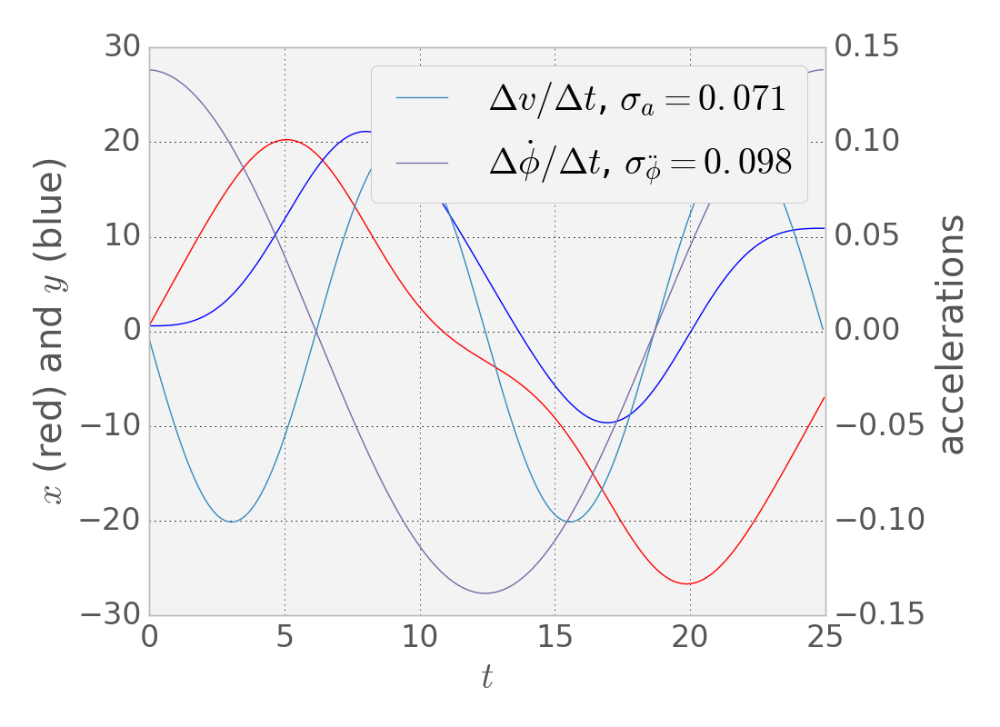

# Unscented Kalman Filter
Self-Driving Car Engineer Nanodegree Program

In [this project](https://classroom.udacity.com/nanodegrees/nd013/parts/40f38239-66b6-46ec-ae68-03afd8a601c8/modules/0949fca6-b379-42af-a919-ee50aa304e6a/lessons/c3eb3583-17b2-4d83-abf7-d852ae1b9fff/concepts/f437b8b0-f2d8-43b0-9662-72ac4e4029c1), 
I use an Unscented Kalman Filter (UKF) to estimate the state of a moving object of interest with noisy lidar and radar measurements.

As with any Bayesian filter, the UKF uses a prediction step and an update step to integrate sensor information with a motion model to estimate a belief distribution for an evolving state. The prediction step propagates the belief forward to the current time using a nonlinear probabilistic motion model and an application of the law of total probability, while the update step uses Bayes rule. Both of these steps involve the computation of expectations--Lebesgue integrals, weighted by probability distributions.

When the motion and observation models (transformations) are linear, and the belief is (assumed to be) Gaussian, these expectations can be computed analytically. However, when these transformations are nonlinear, various tricks are required. The extended Kalman filter (EKF) deals with this problem by computing a local linearization of the transformations, after which the algorithm reduces to the vanilla Kalman filter. However, in regions of state space where the transformation functions have high curvature in relation to the width of the gaussian, this linearization is a poor approximation.

On the other hand, if the transformations can be evaluated pointwise at will, the UKF is applicable. Here, the weighted integrals in question are computed through a method reminiscent of Gaussian quadrature--an array of carefully chosen "sigma points" are propagated through the transformation, then summed with prescribed weights. As the trapezoidal rule for integrating a function prescribes a weighted sum of a grid of evaluations of the function, Gaussian quadrature methods [[Xiu]][1] approximate weighted integrals using a set of nodes and weights derived from the zeros of a set of polynomials defined to be orthogonal with respect to an inner product weighted by the distribution in question. E.g., for a standard Gaussian distribution, the relevant zeros are those of the Hermite polynomials. (For unknown distributions, the polynomials can be approximated using the moments of the distribution [[Oladyshkin & Nowak]][2], though this method has its drawbacks.)

Extending this program of deriving state estimation methods from Bayesian filters using alternative ways of computing expectations will lead, in our next project, to the particle filter, which uses Monte Carlo "integration".

## Code Provenance

Rather than reinventing the wheel, some of the code in this repository came, with slight modifications, from the Udacity [UKF module](https://classroom.udacity.com/nanodegrees/nd013/parts/40f38239-66b6-46ec-ae68-03afd8a601c8/modules/0949fca6-b379-42af-a919-ee50aa304e6a/lessons/daf3dee8-7117-48e8-a27a-fc4769d2b954/concepts/07444c9b-b4be-4615-96e1-e1b221a9add6); other parts (e.g. the `UKF::UpdateLidar` method) are new (but still obviously derived from the Udacity code). There are a couple `TODO` comments indicating where it would be logical to generalize the Udacity approach in the future.

## Parameter Choice

To get a reasonable values for the yaw/tangential acceleration standard deviations, I plotted the ground truth data, as well as the finite differences of the velocity data (see `datavis.py`).

I also computed the standard deviations of this data (see inset) for a lower bound on the variation expected in accelerations. For the noise parameters, I approximately tripled these.

## Covariance Initialization

Since both initialization methods give no information about the initial velocity, I set the velocity (tangential and yaw) components of the initial variance rather high. On the other hand, the LIDAR provides better (x,y) initialization than the RADAR, so I made it's corresponding initial covariance entries lower.

## Build Instructions

This project involves the Term 2 Simulator which can be downloaded [here](https://github.com/udacity/self-driving-car-sim/releases)

This repository includes two files that can be used to set up and intall [uWebSocketIO](https://github.com/uWebSockets/uWebSockets) for either Linux or Mac systems. For windows you can use either Docker, VMware, or even [Windows 10 Bash on Ubuntu](https://www.howtogeek.com/249966/how-to-install-and-use-the-linux-bash-shell-on-windows-10/) to install uWebSocketIO. Please see [this concept in the classroom](https://classroom.udacity.com/nanodegrees/nd013/parts/40f38239-66b6-46ec-ae68-03afd8a601c8/modules/0949fca6-b379-42af-a919-ee50aa304e6a/lessons/f758c44c-5e40-4e01-93b5-1a82aa4e044f/concepts/16cf4a78-4fc7-49e1-8621-3450ca938b77) for the required version and installation scripts.

Once the install for uWebSocketIO is complete, the main program can be built and ran by doing the following from the project top directory.

1. mkdir build
2. cd build
3. cmake ..
4. make
5. ./UnscentedKF

Tips for setting up your environment can be found [here](https://classroom.udacity.com/nanodegrees/nd013/parts/40f38239-66b6-46ec-ae68-03afd8a601c8/modules/0949fca6-b379-42af-a919-ee50aa304e6a/lessons/f758c44c-5e40-4e01-93b5-1a82aa4e044f/concepts/23d376c7-0195-4276-bdf0-e02f1f3c665d)

Here is the main protcol that main.cpp uses for uWebSocketIO in communicating with the simulator.

INPUT: values provided by the simulator to the c++ program

    ["sensor_measurement"] => the measurment that the simulator observed (either lidar or radar)

OUTPUT: values provided by the c++ program to the simulator

    ["estimate_x"] <= kalman filter estimated position x
    ["estimate_y"] <= kalman filter estimated position y
    ["rmse_x"]
    ["rmse_y"]
    ["rmse_vx"]
    ["rmse_vy"]

---

### Other Important Dependencies
* cmake >= 3.5
  * All OSes: [click here for installation instructions](https://cmake.org/install/)
* make >= 4.1 (Linux, Mac), 3.81 (Windows)
  * Linux: make is installed by default on most Linux distros
  * Mac: [install Xcode command line tools to get make](https://developer.apple.com/xcode/features/)
  * Windows: [Click here for installation instructions](http://gnuwin32.sourceforge.net/packages/make.htm)
* gcc/g++ >= 5.4
  * Linux: gcc / g++ is installed by default on most Linux distros
  * Mac: same deal as make - [install Xcode command line tools](https://developer.apple.com/xcode/features/)
  * Windows: recommend using [MinGW](http://www.mingw.org/)

## Bibliography

[1]: http://books.google.com/books/p/princeton?id=GY9qyJd4CvQC&pgis=1

Xiu, D. (2010). Numerical Methods for Stochastic Computations: A Spectral Method Approach. Princeton, NJ: Princeton University Press.

[2]:  https://doi.org/10.1016/j.ress.2012.05.002

Oladyshkin, S., & Nowak, W. (2012). Data-driven uncertainty quantification using the arbitrary polynomial chaos expansion. Reliability Engineering & System Safety, 106, 179–190.
